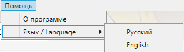
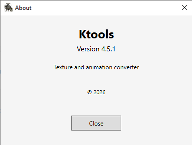
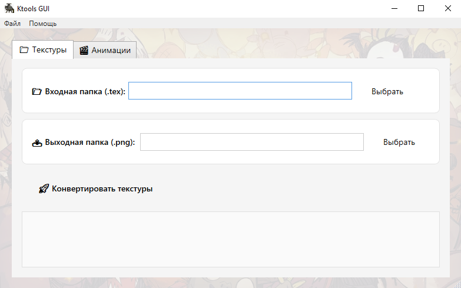
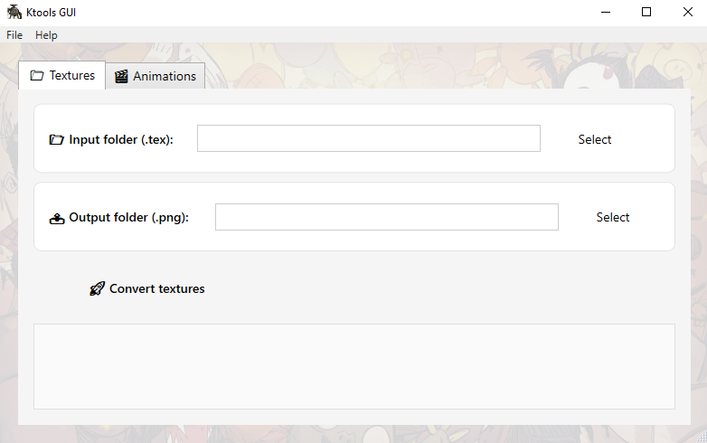
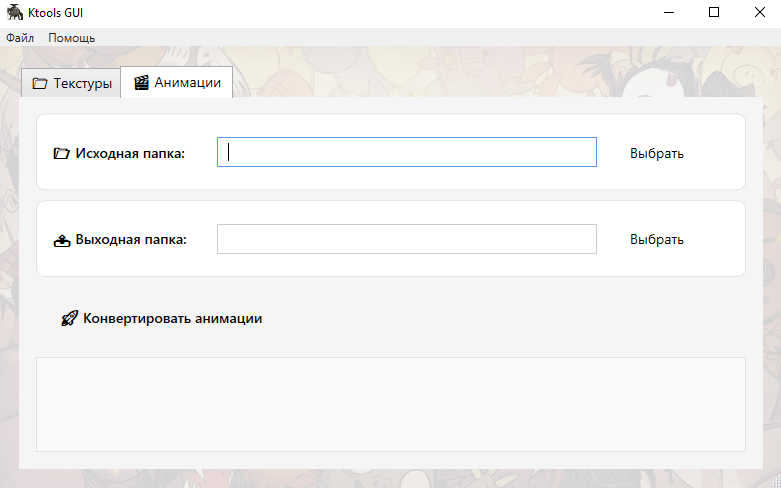
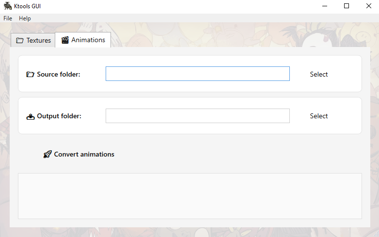

# KtoolsGui

Graphical interface for Ktools utilities (ktex2png and krane). Allows you to convert textures and animations in a convenient format using buttons rather than the command line.
## About

KtoolsGui is a tool for Don't Starve Together modders. Convert animation files (.build.bin to PNG), work with number systems, and enjoy a modern interface designed for efficient mod development.


## Features

- 📁 Texture conversion (.tex → .png)
- 🎬 Animation conversion (.build.bin → .png)
- 🌐 Bilingual interface (Russian / English)
- 🎨 Nice design with background
- 🚀 Fast one - click conversion
- Built for DST modding

## Requirements

- Windows 10/11
- .NET 8.0 Runtime

## Installation

1. Download the latest version from [Releases](https://github.com/sergeikirillov511-KING/KtoolsGui/releases ).
2. Unzip the archive to any folder.
3. Run `KtoolsGui.exe `.

## Usage

### Texture conversion

1. Open the **📁 Textures** tab.
2. Select the input folder with the `.tex' files.
3. Select the output folder for the `.png` files.
4. Press **🚀 Convert textures**.

### Animation conversion

1. Open the ** tab Animations**.
2. Select the folder with `build.bin'.
3. Select the output folder.
4. Press **🚀 Convert animations**.

## Screenshots


### Main window





### Animations



## Build from source

```bash
git clone [https://github.com/sergeikirillov511-KING/KtoolsGui.git](https://github.com/sergeikirillov511-KING/KtoolsGui.git)
cd KtoolsGui
dotnet build
```

## License

MIT License — see the [LICENSE](LICENSE) file.

## Contacts

If you have any questions or suggestions, create an [Issue](https://github.com/sergeikirillov511-KING/KtoolsGui/issues ).
